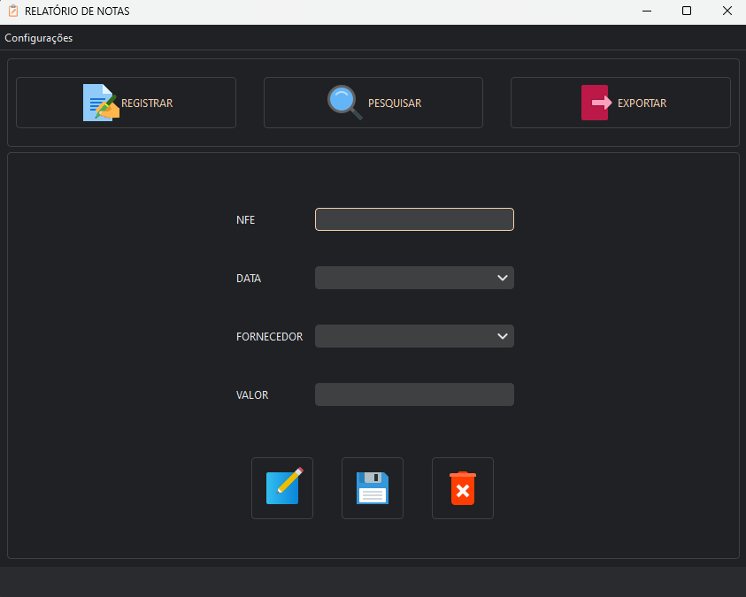
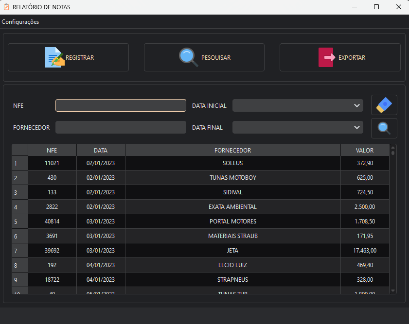
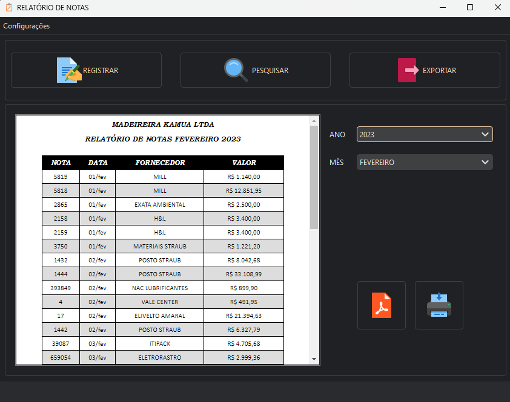
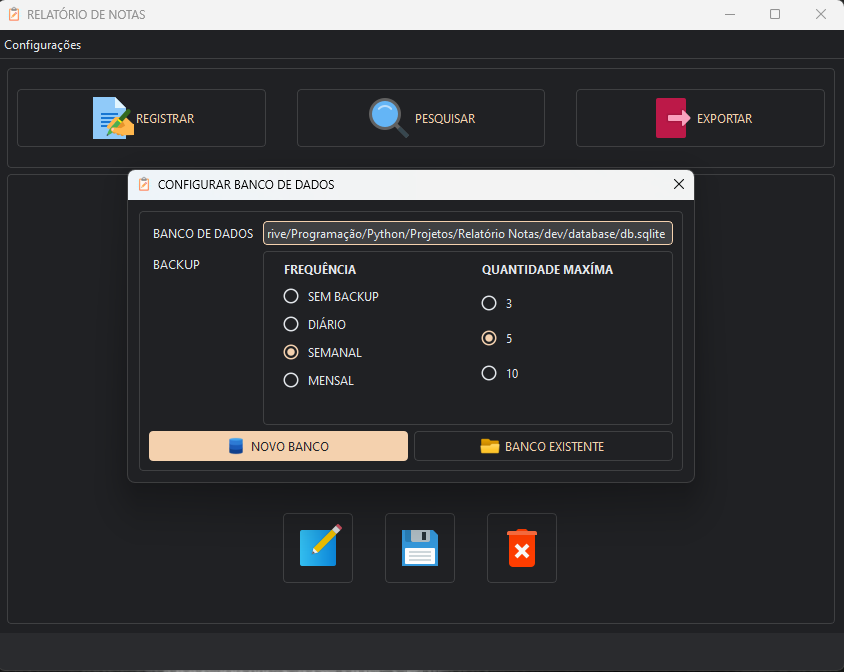
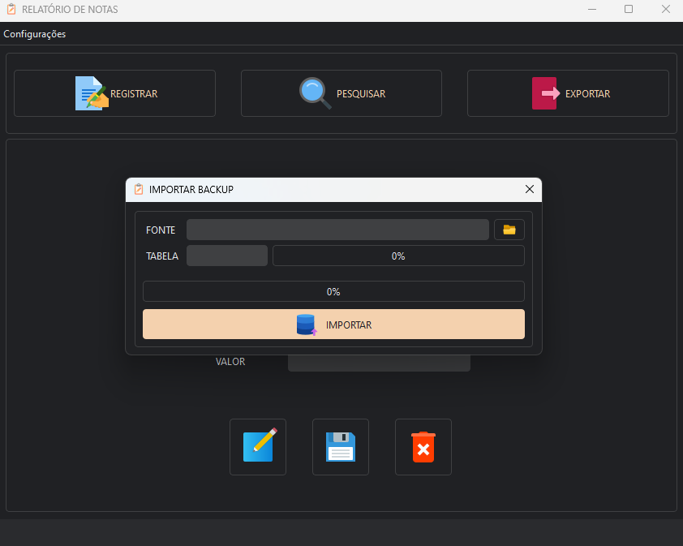

# ❤️ Relatório de Notas

Aplicação feita exclusivamente para uso interno de uma empresa na qual fiz parte.

Aplicativo para controle de notas fiscais com relatório criado dinâmicamente, banco de dados compartilhado na rede e 
possibilidade de acesso simultâneo, sistema de backup automático, dark / light mode e mais!

Para baixar a versão de distribuição clique
[aqui](https://github.com/Paulo1402/Relatorio-de-Notas/releases/download/v1.0.0/installer.exe). (Apenas para Windows).

## 🖼️ Imagens

---

## Requisitos para desenvolvimento:

- Python (Foi usado a versão 3.11, mas muito provavelmente deve funcionar em outra versão próxima).
- Baixar ou clonar o repositório.
- Com a pasta do repositório aberta no terminal rode o comando `pip install ./dev/requirements.txt` para instalar as
  dependências (De preferência com um virtual environment ativo).
- Rodar o script de entrada usando `python ./src/main.py`.

## 🛠 Tecnologias e Libs

- Python
- PySide6
- PyQtDarkTheme
- AutoPyToExe
- Jinja2

#### Icons8 - https://icons8.com.br
